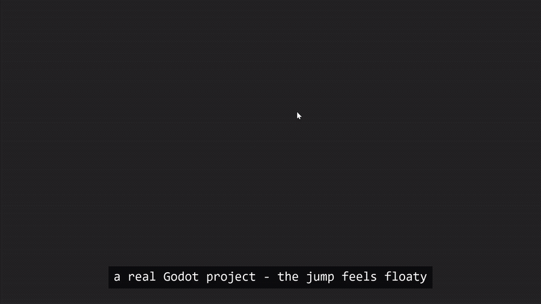

<p align="center">
  
</p>

<h1 align="center">kite</h1>

<p align="center">
  <strong>Let your coding agent feel your game.</strong><br />
  A game-feel harness for Godot - input latency, response curves, replayable telemetry.
</p>

<p align="center">
  <a href="https://runkite.dev">runkite.dev</a> ·
  <a href="https://github.com/jamba-labs/kite/actions/workflows/ci.yml"></a>
  <a href="LICENSE"></a>
</p>

---

Coding agents can build games but they can't *play* them. The character
controller compiles, the tests pass - and the jump feels like wet cardboard,
and no amount of prompting fixes it, because the agent is blind.

**Kite gives your agent eyes.** It runs your game with scripted inputs, records
every physics frame, and turns the recording into measured game-feel - input
latency, jump arc, response curves, assist windows - in a vocabulary the agent
already understands. So you can just say what you mean:

> *"the jump feels floaty and loose - tune it"*

...and the agent measures, changes the code, re-runs, and tells you what moved -
no guessing, no rigid spec.



The agent brings the taste; Kite brings the ruler. It measures *behavior* and
reports it - how your game stores its feel (constants, exported vars,
resources, curves) is the agent's problem, not Kite's; it never reads your
source.

**Want a hard target or a CI gate?** That's optional - pin a *feel contract*
and a run becomes pass/fail with a gradient to each goal:

```
kite run feel_test - vs contract: snappy                  FAIL (1/8 rules)

  ✓ input.latency_to_motion_frames    1.25 frames        (max 3)
  ✗ jump.apex_time_s                  0.5367 s           (target 0.3-0.42)   → reduce by ~0.117 s
  ✗ run.decel_shape                   linear (k=1)       (want ease-out, k≥2)
  ✗ assist.coyote_window_ms           0 ms               (target 60-120)     → increase by ~60.00 ms
  ...
```

`snappy` / `floaty` / `weighty` ship as forkable presets - they're a
convenience for CI and team targets, not the interface. Most of the time you
just describe the feel.

## How it works

| Layer | What it is |
|---|---|
| [Telemetry](docs/telemetry.md) | A Godot addon replays input scripts deterministically and records frame-sampled JSONL. Same script + same seed → byte-identical output. |
| [Metrics](docs/metrics.md) | The analyzer derives feel measurements - input latency, jump arc (apex, rise:fall, hang), accel/decel curve shapes, empirically-probed coyote/buffer windows. **This is the core**: named, objective numbers the agent maps your feel-words onto. |
| [Feel contracts](docs/feel-contracts.md) *(optional)* | Target rules over those metrics for when you want a hard goal or a CI gate. `snappy` / `floaty` / `weighty` ship as forkable presets. |

All analysis is engine-agnostic - the addon is a dumb recorder, which is what
makes other engines a port rather than a rewrite.

## Quickstart

Requirements: [Godot 4.x](https://godotengine.org), [Node 20+](https://nodejs.org).

```sh
# 1. In your Godot project: install the addon
#    (Asset Library: "Kite", or copy addons/kite/ from this repo)
#    then register the autoload - Project Settings → Plugins → enable Kite,
#    or add to project.godot:
#      [autoload]
#      KiteHarness="*res://addons/kite/kite_harness.gd"

# 2. Put your player node in the "kite_track" group
#    (position/velocity are recorded automatically; expose an optional
#     `state` string property to record state-machine transitions)

# 3. Scaffold config + a sample test
npx @jamba-labs/kite init

# 4. Measure the feel - raw metrics, no target needed
npx @jamba-labs/kite run jump_test

# ...or check against a target / CI gate (optional)
npx @jamba-labs/kite run jump_test --contract snappy
```

You'll get a terminal summary plus `runs/jump_test.report.json`. Exit code 1
when the contract fails - drop it straight into CI.

**No project yet?** This repo ships a [fixture platformer](fixture/) with
deliberately floaty defaults - clone, `npm install && npm run build`, then
`node dist/cli.js run feel_test --project fixture --contract snappy`.

## CLI

```
kite run <test> [--contract <name|path>] [--seed n] [--windowed]   measure + judge
kite probe [coyote|buffer|all]                                     measure assist windows empirically
kite list                                                          list tests
kite init                                                          scaffold kite.json + sample test
```

Input scripts are JSON, pinned to physics frames (that's what makes replay
deterministic - see [the format](docs/telemetry.md#input-script-format-kite_inputs-01)):

```json
{ "kite_inputs": "0.1",
  "actions": { "jump": "digital", "move_x": "axis" },
  "events": [ { "f": 60, "a": "jump", "v": 1 }, { "f": 66, "a": "jump", "v": 0 },
              { "f": 240, "a": "end" } ] }
```

---

## For your agent

Kite ships an MCP server - the native surface for Claude Code and friends:

```sh
claude mcp add kite -- npx -y -p @jamba-labs/kite kite-mcp --project .
```

Tools: `kite_run`, `kite_probe`, `kite_list_tests`, `kite_report`.

Then add the tune-loop guide to your project's `CLAUDE.md` (or equivalent) -
the full drop-in snippet lives in **[docs/agents.md](docs/agents.md)**, and
[`llms.txt`](llms.txt) indexes the docs for agent consumption. The short
version of the loop:

1. Measure first: `kite_run` with a contract → per-rule pass/fail + numeric deltas
2. Change whatever code drives the failing metric - wherever your feel values live
3. Re-run; the deltas are your gradient
4. `kite_probe` only after touching assist behavior (it's slower)
5. Done when the contract reports PASS

This works: an agent has taken the fixture from floaty to a full
8/8 snappy PASS autonomously, computing correct values from the report's
deltas in a single edit cycle.

---

## Status

v0.1 - Godot 4.x, 2D platformer movement metric pack. Deliberately not yet:
other engines, 3D, combat feel, regression diffing (`kite diff`), realtime
mode. The telemetry schema is the contract that makes those additions, not
rewrites.

## Contributing

PRs and issues welcome - see [CONTRIBUTING.md](CONTRIBUTING.md). The short
version: analyzer changes need tests with answers derived from math (not
blessed output), and recorder changes must keep the determinism gate green.

## License

[MIT](LICENSE) © Jamba Labs
